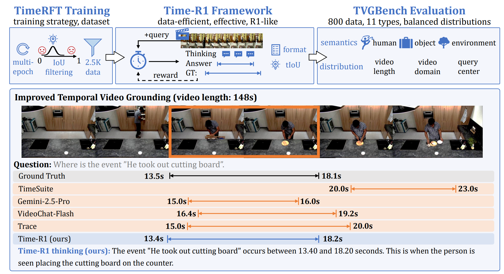
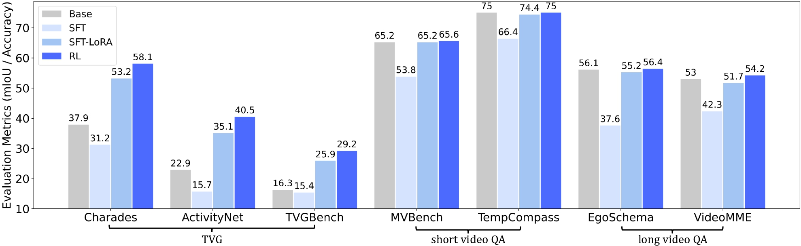

# Time-R1: Post-Training Large Vision Language Model for Temporal Video Grounding

<div style='display:flex; gap: 0.25rem; '>
  <a href='https://arxiv.org/pdf/2503.13377v2'></a>
  <a href='https://huggingface.co/Boshenxx/Time-R1-3B'></a>
  <a href='https://huggingface.co/Boshenxx/Time-R1-7B'></a>
  <a href='https://huggingface.co/datasets/Boshenxx/TimeR1-Dataset'></a>
    <a href='https://xuboshen.github.io/Time-R1/'></a>
</div>

<p align="center" width="100%">
<a target="_blank"></a>
</p>

Note: TimeZero is the original version
> [**Time-R1: Post-Training Large Vision Language Model for Temporal Video Grounding**](https://arxiv.org/abs/2503.13377v2) <br>
> Ye Wang*, Ziheng Wang*, Boshen Xu*‡, Yang Du, Kejun Lin, Zihan Xiao, Zihao Yue, Jianzhong Ju, Liang Zhang, Dingyi Yang, Xiangnan Fang, Zewen He, Zhenbo Luo, Wenxuan Wang, Junqi Lin, Jian Luan, Qin Jin† <br>
[](https://github.com/xiaomi-research/Time-R1) [](https://github.com/xiaomi-research/Time-R1)[](https://arxiv.org/abs/2503.13377v2) <br>
> [**TimeZero: Temporal Video Grounding with Reasoning-Guided LVLM**](https://arxiv.org/abs/2503.13377v1) <br>
> Ye Wang*, Boshen Xu*, Zihao Yue, Zihan Xiao, Ziheng Wang, Liang Zhang, Dingyi Yang, Wenxuan Wang, Qin Jin† <br>
[](https://github.com/www-Ye/Time-R1) [](https://github.com/www-Ye/Time-R1)[](https://arxiv.org/abs/2503.13377v1) <br>
    

## TODO List

- [ ] Base model support for MiMo-VL and Intern3-VL

## Overview

### Contributions of Time-R1

*   **Time-R1: RL-based framework for temporal video grounding**. We introduce a reasoning-guided post-training framework via RL with verifiable reward to enhance the capabilities of LVLMs on the TVG task. 
*   **TimeRFT: Time-aware reinforcement fine-tuning.** We explore data-efficient post-training strategies on our curated RL-friendly dataset, which trains the model to progressively comprehend difficult samples, leading to better generalization.
*   **TVGBench: Comprehensive benchmark for LVLMs on TVG.** We carefully construct a small yet comprehensive benchmark for LVLM evaluation, assessing 11 types of queries and featuring balanced distributions across both videos and queries.
*   **State-of-the-Art results and generalization.** Extensive experiments demonstrate that Time-R1 achieves state-of-the-art performance across multiple downstream datasets using only 2.5K training data, while improving its general video understanding capabilities. 

### Key Features of this codebase:

*   **A codebase that supports training LVLM with RL.** 
*   **Speedup inference time for temporal video grounding and video QA by vllm library.**
*   **Experiment toolkits**: Support training on our TimeRFT, Charades, and ActivityNet; support vLLM inference on TVGBench, Charades, ActivityNet, MVBench,s TempCompass, VideoMME, EgoSchema.

## Setup

### Install
see [docs/INSTALL.md](./docs/INSTALL.md)

### Quick Start

Demo I/O: 
```bash
CUDA_VISIBLE_DEVICES=0 python demo.py --model_base ./ckpts/Time-R1-7B --video_path ./assets/OHOFG.mp4 --query "person sitting down in a chair."
```

### Dataset

see [docs/DATA.md](./docs/DATA.md)


## Training    
For TimeRFT post-training process:
```bash
# w/ sample filtering per epoch
bash scripts/posttrain/run_rl_SF.sh
# w/o sample filtering per epoch
bash scripts/posttrain/run_rl.sh
```

For fine-tuning on downstream benchmarks like Charades and ActivityNet:

```bash
# first preprocess dataset
bash scripts/finetune/preprocess_videos_ch.sh
# then finetune
bash scripts/finetune/run_charades.sh
```

## Evaluation

After training, evaluate your model's performance on TVGBench/Charades/Activitynet/MVBench/TempCompass/VideoMME/EgoSchema:

```bash
# remember to change BASE_PATH, EVAL_DATASET, and MODEL_NAME in test.sh
bash scripts/test.sh
```

## Results
We mainly compare with 7B opensourced LVLMs trained by SFT.
-   **TVGBench (ZeroShot)**

| Method                | Type | R1@0.3 | R1@0.5 | R1@0.7 |
| --------------------- | ---- | ------ | ------ | ------ |
| Gemini-2.5-Pro       | -  | 39.1      | 24.4   | 12.8   |
| VideoChat-Flash | SFT  | 32.8   | 19.8   | 10.4   |
| TimeSuite | SFT  | 31.1   | 18.0   | 8.9   |
| TRACE | SFT  | 37.0   | 25.5   | 14.6   |
| Time-R1 (ours)       | RL   | 41.8   | 29.4   | 16.4   |

-   **Charades-STA (ZeroShot)**

| Method                | Type | R1@0.3 | R1@0.5 | R1@0.7 |
| --------------------- | ---- | ------ | ------ | ------ |
| VideoChat-Flash | SFT  | 74.5   | 53.1   | 27.6   |
| TimeSuite       | SFT  | 69.9      | 48.7   | 24.0   |
| TRACE       | SFT  | -      | 40.3   | 19.4   |
| Time-R1 (ours)       | RL   | 78.1   | 60.8   | 35.3   |

-   **ActivityNet (ZeroShot)**

| Method            | Type | R1@0.3 | R1@0.5 | R1@0.7 |
| ----------------- | ---- | ------ | ------ | ------ |
| HawkEye | SFT  | 49.1   | 29.3   | 10.7   |
| VTimeLLM | SFT  | 44.0   | 27.8   | 14.3   |
| Time-R1 (ours)    | RL   | 58.6   | 39.0   | 21.4   |

---
---

-   **Charades-STA (FineTune)**

| Method                | Type | R1@0.3 | R1@0.5 | R1@0.7 |
| --------------------- | ---- | ------ | ------ | ------ |
| EaTR       | VLP  | -      | 68.4   | 44.9   |
| HawkEye       | SFT  | 72.5      | 58.3   | 28.8   |
| TimeSuite       | SFT  | 79.4      | 67.1   | 43.0   |
| Time-R1 (ours)       | RL   | 82.8   | 72.2   | 50.1   |

-   **ActivityNet (FineTune)**

| Method            | Type | R1@0.3 | R1@0.5 | R1@0.7 |
| ----------------- | ---- | ------ | ------ | ------ |
| SSRN | VLP  | -   | 54.5   | 33.2   |
| SnAG | VLP  | -   | 48.6   | 30.6   |
| EaTR | VLP  | -   | 58.2   | 37.6   |
| HawkEye | SFT  | -   | 37.7   | 24.0   |
| TRACE | SFT  | -   | 37.7   | 24.0   |
| Time-R1 (ours)    | RL   | 73.3   | 55.6   | 34.0   |


Comparison between post-training paradigms across various tasks, including temporal
video grounding, short video QA, and long video QA. Both “SFT” and “RL” full-finetune the LLM,
while “SFT-LoRA” denotes finetuning the LLM with LoRA. The “Base” is Qwen2.5-VL-7B.

<p align="center" width="100%">
<a target="_blank"></a>
</p>


## Acknowledgements

We thank the following projects: [TRACE](https://github.com/gyxxyg/TRACE), [R1-V](https://github.com/Deep-Agent/R1-V), [Qwen2.5-VL](https://github.com/QwenLM/Qwen2.5-VL), [TRL](https://github.com/huggingface/trl), [vLLM](https://github.com/vllm-project/vllm)

## Citation

If you find our work useful, please consider cite our paper :)


```bibtex
@article{wang2025timer1,
      title={Time-R1: Post-Training Large Vision Language Model for Temporal Video Grounding}, 
      author={Wang, Ye and Wang, Ziheng and Xu, Boshen and Du, Yang and Lin, Kejun and Xiao, Zihan and Yue, Zihao and Ju, Jianzhong and Zhang, Liang and Yang, Dingyi and Fang, Xiangnan and He, Zewen and Luo, Zhenbo and Wang, Wenxuan and Lin, Junqi and Luan, Jian and Jin, Qin},
      journal={arXiv preprint arXiv:2503.13377},
      year={2025},
}
```

```bibtex
@article{wang2025timezero,
      title={TimeZero: Temporal Video Grounding with Reasoning-Guided LVLM},
      author={Wang, Ye and Xu, Boshen and Yue, Zihao and Xiao, Zihan and Wang, Ziheng and Zhang, Liang and Yang, Dingyi and Wang, Wenxuan and Jin, Qin},
      journal={arXiv preprint arXiv:2503.13377},
      year={2025}
}
```